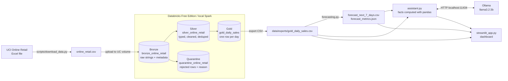

# AI Retail Analytics

A small, end-to-end data engineering project on the
[UCI Online Retail dataset](https://archive.ics.uci.edu/dataset/352/online+retail)
(UK online gift retailer, Dec 2010 to Dec 2011):

1. **Bronze / Silver / Gold** medallion pipeline in PySpark + Delta Lake on Databricks Free Edition
2. Seven-day revenue forecast with scikit-learn, evaluated on a chronological hold-out
3. Local LLM assistant (Ollama) that answers questions from the real metrics and forecast
4. Streamlit dashboard with historical sales, the forecast, model accuracy and AI explanations

> **Status:** Stage 1 (pipeline) runs on Databricks with real results below. Stage 2 (forecast) runs on the real Gold export, results below. Stage 3 (assistant) is tested with llama3.2:3b on the real data. Stage 4 (dashboard) is implemented and tested headlessly.

## Architecture



The pipeline logic lives in a normal Python package (`src/retail_analytics/`). The
Databricks notebooks are thin wrappers around it, so the **same code** runs on
Databricks, locally, and in `pytest`.

## Folder structure

```
ai-retail-analytics/
├── README.md
├── requirements.txt              # laptop: download, forecast, tests
├── requirements-spark.txt        # optional: run the Spark pipeline locally
├── pyproject.toml                  # pytest config
├── streamlit_app.py                # dashboard (stage 4)
├── data/                           # git-ignored; created by the scripts
│   ├── raw/online_retail.csv
│   ├── delta/<table>/              # local Delta tables
│   ├── exports/gold_daily_sales.csv
│   └── outputs/                  # forecast results
├── notebooks/                      # Databricks notebooks (source format .py)
│   ├── 00_setup.py
│   ├── 01_bronze_ingest.py
│   ├── 02_silver_clean.py
│   └── 03_gold_daily_sales.py
├── scripts/
│   └── download_data.py            # UCI zip -> Excel -> CSV
├── src/retail_analytics/
│   ├── config.py                   # table names and paths (Databricks vs local)
│   ├── storage.py                  # SparkSession + Delta read/write
│   ├── bronze.py
│   ├── silver.py
│   ├── gold.py
│   ├── quality.py                  # data quality checks
│   ├── pipeline.py                 # runs the stages; local CLI entry point
│   ├── forecasting.py              # 7-day revenue forecast (scikit-learn)
│   └── assistant.py                # local LLM Q&A grounded in the data (Ollama)
└── tests/
```

## Data model

| Layer | Table | Grain | What happens |
|---|---|---|---|
| Bronze | `bronze_online_retail` | one row per CSV line | All 8 source columns kept as strings, plus `_source_file` and `_ingested_at`. Nothing is dropped. |
| Silver | `silver_online_retail` | one row per valid sales line | snake_case names, types cast with `try_cast` (bad values become NULL instead of crashing), `invoice_date` and `line_total` derived. |
| Silver | `quarantine_online_retail` | one row per rejected line | Same columns plus `rejection_reason`. |
| Gold | `gold_daily_sales` | one row per calendar day | `revenue`, `orders`, `units_sold`, `unique_customers`, `line_items`, `avg_order_value`, `day_of_week`, `is_trading_day`. |

**Silver rejection rules** (first matching rule wins): missing invoice number or stock code,
unparseable date / quantity / price, cancelled invoice (`InvoiceNo` starts with `C`),
quantity ≤ 0, unit price ≤ 0, non-product stock codes (postage, fees, manual adjustments:
see `NON_PRODUCT_CODES` in `silver.py`), and exact duplicate lines (first copy kept).
Rows with no `CustomerID` are **kept**: they are still real sales, just from guest checkouts.

**Gold** includes every day between the first and last sale. Days with no trading
(the shop does not trade on Saturdays, plus the Christmas break) appear with zero
revenue and `is_trading_day = false`, which the forecasting stage needs.

**Data quality checks** (`quality.py`) run after Silver and Gold are written and stop the
pipeline if any fail: no nulls in key columns, positive quantities and prices, no
cancellations, one Gold row per date, no missing dates, and Gold revenue reconciling with Silver.

## Setup

### 1. Get the data (on your laptop)

Requires Python 3.10–3.12 (3.11 recommended).

```bash
git clone https://github.com/vishalreddy9514/ai-retail-analytics.git
cd ai-retail-analytics
python -m venv .venv
source .venv/bin/activate            # Windows: .venv\Scripts\activate
pip install -r requirements.txt
python scripts/download_data.py
```

Expected output (the Excel read takes about a minute):

```
Downloading https://archive.ics.uci.edu/static/public/352/online+retail.zip ...
Reading .../data/raw/Online Retail.xlsx (takes ~1 minute) ...
Wrote 541,909 rows and 8 columns to .../data/raw/online_retail.csv
Invoice dates: 2010-12-01 08:26:00 to 2011-12-09 12:50:00
```

If the download fails, download the zip manually from the UCI page, unzip it and run
`python scripts/download_data.py --xlsx "path/to/Online Retail.xlsx"`.

### 2a. Run on Databricks Free Edition (main path)

1. Sign up at <https://www.databricks.com/learn/free-edition> and open your workspace.
2. In Databricks: **Workspace → Create → Git folder**, paste `https://github.com/vishalreddy9514/ai-retail-analytics`.
3. Open `notebooks/00_setup.py`, attach **Serverless** compute, and run it. This creates
   schema `workspace.retail` and volume `raw_files`.
4. **Catalog → workspace → retail → raw_files → Upload to this volume**: upload
   `data/raw/online_retail.csv`. Re-run the last cell of `00_setup` to confirm it is listed.
5. Run `01_bronze_ingest`, `02_silver_clean`, `03_gold_daily_sales` in order.
6. Download `raw_files/exports/gold_daily_sales.csv` from the Catalog UI and save it as
   `data/exports/gold_daily_sales.csv` locally. Later stages use this file.

### 2b. Run locally (optional, same code)

Needs Java 17 (`java -version`) and `pip install -r requirements-spark.txt`. On first run Spark downloads the Delta Lake jars from Maven (~5 MB).

```bash
PYTHONPATH=src python -m retail_analytics.pipeline
# Windows PowerShell: $env:PYTHONPATH="src"; python -m retail_analytics.pipeline
```

It prints the row counts, each data quality check as `[PASS]`/`[FAIL]`, the quarantine
counts by reason, and writes `data/exports/gold_daily_sales.csv`.

### Results on the full dataset

From a run on Databricks Free Edition (serverless), 9 October 2026:

| Layer | Rows |
|---|---|
| Bronze | 541,909 (matches the row count UCI publishes) |
| Silver | 522,568 |
| Quarantine | 19,341 |
| Gold | 374 days (2010-12-01 to 2011-12-09) |

| Quarantine reason | Rows |
|---|---|
| cancelled_invoice | 9,288 |
| duplicate | 5,221 |
| non_product_code | 2,315 |
| non_positive_quantity | 1,336 |
| non_positive_unit_price | 1,181 |

Silver + quarantine = Bronze, so every raw row is accounted for. No row failed type
parsing (no `invalid_*` reasons). All 13 data quality checks passed, and Gold revenue
reconciles exactly with Silver (£10,247,905.13). Saturdays have zero revenue: the
retailer does not trade on Saturdays.

Note: 2011-12-09 is a partial day (data ends at 12:50), so its revenue is lower than a normal day.

## Stage 2: seven-day revenue forecast

Runs on your laptop with pandas and scikit-learn, reading the Gold export.

**How it works** (`src/retail_analytics/forecasting.py`):

- **Target:** daily `revenue`. The last day (2011-12-09) is dropped because the data stops at 12:50 that day.
- **Features:** day of week, revenue 7 and 14 days ago, and the 7-day and 28-day averages ending 7 days ago.
  Every feature is at least 7 days old, so one model predicts all 7 future days from known
  history, and no future information can leak into training.
- **Chronological split:** the last 56 days (8 weeks) are the test set; everything before is training.
  Time series are never shuffled.
- **Models compared:**
  - `seasonal_naive` baseline: "same as the same weekday last week". A model is only useful if it beats this.
  - `linear_regression`: Ridge regression on scaled features and one-hot weekday.
  - `random_forest`: 300 trees, `random_state=42` for reproducible results.
- **Metrics:** MAE (average error in £) and RMSE (penalises big misses more), on the test set.
- **Forecast:** the model with the lowest test MAE is refit on all history and predicts the next 7 days.

```powershell
# Windows, from the project folder with .venv active
pip install -r requirements.txt
$env:PYTHONPATH="src"
python -m retail_analytics.forecasting
```
On Mac/Linux: `PYTHONPATH=src python -m retail_analytics.forecasting`.

Input: `data/exports/gold_daily_sales.csv` (downloaded from Databricks, step 6 above).
Outputs in `data/outputs/`:

| File | Contents |
|---|---|
| `forecast_metrics.json` | train/test date ranges, MAE and RMSE per model, best model |
| `forecast_test_predictions.csv` | actual vs predicted revenue for every test day, per model |
| `forecast_next_7_days.csv` | `forecast_date`, `day_of_week`, `forecast_revenue`, `model` |

**Results** (real Gold export, run on 9 October 2026). Train: 2011-01-04 to 2011-10-13 (283 days).
Test: 2011-10-14 to 2011-12-08 (56 days).

| Model | MAE (£) | RMSE (£) |
|---|---|---|
| **seasonal_naive** (baseline) | **11,207.54** | **15,904.82** |
| random_forest | 11,562.84 | 16,640.33 |
| linear_regression | 13,192.54 | 17,882.29 |

The baseline wins, so it is used for the 7-day forecast. The test window is the pre-Christmas
peak, and revenue there is higher than anything in the training period. A random forest
cannot predict above the range it was trained on, and the linear model is pulled towards
the yearly average, while "same weekday last week" follows the rising level automatically.
With only one year of history, the models cannot learn yearly seasonality; more history
(or a trend/seasonality feature) would be the next step. Saturdays are correctly forecast at £0.

## Stage 3: local LLM assistant (Ollama)

Ask questions in plain English and get answers based on the real Gold metrics and the forecast.
The model runs locally through [Ollama](https://ollama.com): free, offline, and the data never leaves your machine.

**How it stays grounded** (`src/retail_analytics/assistant.py`), without a vector database or agent framework:

1. **pandas computes the facts**: totals, monthly revenue with the change from the previous month,
   average revenue per weekday, top days, the last 14 days, the 7-day forecast (ranked, with its
   total and the change against the previous 7 days), and the model scores with the typical error as a
   % of daily revenue. If the question names dates (`2011-11-15`), those days are added; if it
   names two or more months (`November 2011`, `oct`), a ready-made comparison is added.
   That is simple keyword retrieval.
2. **The facts are sent to the model** with a system prompt telling it to use only those facts,
   to copy each figure with its own date, never to calculate anything itself, and to say when
   a figure is not available. Temperature is 0, so the same question gets the same answer.
3. **The numbers are checked**: every number in the answer is compared with the facts, and any
   that don't appear (for example, a sum the model worked out itself, or a made-up figure) are listed under the answer.

The model does no arithmetic that matters: totals and percentage changes are calculated in
pandas and given to it.

**Setup:** install Ollama from <https://ollama.com/download> (choose "use Ollama locally", no account needed), then:

```powershell
ollama pull llama3.2:3b        # ~2 GB, runs on a laptop with 8 GB RAM
```

**Run** (from the project folder, venv active, after stage 2 has written `data/outputs/`):

```powershell
$env:PYTHONPATH="src"
python -m retail_analytics.assistant "Which month had the highest revenue?"
python -m retail_analytics.assistant --explain-forecast
python -m retail_analytics.assistant                     # interactive: ask several questions
python -m retail_analytics.assistant "How was November 2011?" --show-context   # also print the facts sent
```

Use another model with `--model` (e.g. `--model llama3.1:8b`), or set `OLLAMA_MODEL`. If Ollama
runs somewhere else, set `OLLAMA_HOST` (default `http://localhost:11434`).

**Real run with `llama3.2:3b` (9 October 2026).** The first version gave the model raw monthly
totals and let it compare months itself. Asked *"How did November 2011 compare to October 2011?"*,
it invented monthly units and customer counts and subtracted wrongly. The number check flagged four
figures, and it also paired a forecast value with the wrong date. After moving every calculation into pandas
(month-over-month changes, month comparisons, a ranked forecast), the same questions gave:

- *"November 2011 revenue (£1,452,115.98) was £348,785.06 (+31.6%) higher than October 2011 revenue (£1,103,330.92)."*: no flagged numbers.
- Forecast explanation: highest day 2011-12-12 (Mon) £80,011.23, Saturday £0.00, total £365,799.46,
  seasonal_naive MAE £11,207.54 = 25.3% of average daily revenue in the test period.

**Limitations:** a 3B model can still misread or mix up figures, which is why the number
check exists and why answers should be checked against the dashboard. It only knows what
is in the Gold table (daily totals), not individual products or customers.

## Stage 4: Streamlit dashboard

```powershell
streamlit run streamlit_app.py
```
It opens at <http://localhost:8501>. It reads `data/exports/gold_daily_sales.csv` and `data/outputs/`,
so run the forecast (stage 2) first. Ollama must be running for the AI sections only; the rest works without it.

What it shows:

- **KPIs:** total revenue, orders, average revenue per trading day, average order value.
- **Daily revenue and 7-day forecast:** actual sales (blue) and the forecast (orange, dashed),
  with a sidebar slider for how many days of history to show. Hover any point for its value.
- **Monthly revenue** and the **next 7 days** table with the forecast total.
- **AI explanation of the forecast:** one click asks the local model (stage 3) to explain the
  forecast. Any number not found in the data is flagged, and "Facts sent to the model" shows exactly what it was given.
- **Ask a question:** free-text questions answered from the same facts.
- **How accurate is the forecast?:** MAE/RMSE per model, the typical error as a % of daily revenue,
  and a chart of actual vs predicted revenue over the test period for any model.

Colours: blue `#2a78d6` and orange `#eb6834`, a pair chosen to stay distinguishable for colour-blind
readers. Every chart with two series has a legend.

## Tests

```bash
pytest -q
```

With only `requirements.txt` installed, the forecasting, assistant and dashboard tests run
(Ollama is replaced by a fake, so it doesn't need to be running) and the Spark tests are
reported as skipped. Install `requirements-spark.txt` (and Java 17) to run them all.

The Spark tests run on a local SparkSession with small hand-written rows that cover each cleaning
rule, the Gold aggregation and zero-filling, the quality checks, and one end-to-end run
writing real Delta tables to a temporary folder. The first run takes about a minute
while Spark starts.

## Troubleshooting

| Problem | Fix |
|---|---|
| `No module named sklearn` | `pip install -r requirements.txt` with the venv active. |
| `data/exports/gold_daily_sales.csv not found` | Download it from **Catalog → workspace → retail → raw_files → exports** and save it in `data/exports/`. |
| `Cannot reach Ollama at http://localhost:11434` | Start the Ollama app (llama icon by the clock), or run `ollama serve` in another terminal. |
| `Model 'llama3.2:3b' is not installed` | `ollama pull llama3.2:3b` |
| Assistant is very slow | The first answer loads the model (10–60 s). On low-RAM laptops close other apps, or try `--model llama3.2:1b` after `ollama pull llama3.2:1b`. |
| `streamlit` is not recognized | `pip install -r requirements.txt` with the venv active. |
| Dashboard says `gold_daily_sales.csv not found` | Save the Databricks export to `data/exports/` (see step 6 above). |
| Port 8501 already in use | `streamlit run streamlit_app.py --server.port 8502` |
| `JAVA_HOME is not set` / `Java gateway process exited` (local) | Install Java 17 (e.g. Temurin) and set `JAVA_HOME`. |
| `pip install pyspark` fails building a wheel | Upgrade build tools in your venv: `pip install -U pip setuptools wheel`. |
| `ModuleNotFoundError: retail_analytics` | Locally: set `PYTHONPATH=src`. On Databricks: open the notebook from the Git folder, not a copy, so `../src` exists. |
| Notebook doesn't pick up a code change in `src/` | Run `%restart_python` (or detach/re-attach), then re-run the notebook. |
| `PATH_NOT_FOUND ... /Volumes/workspace/retail/raw_files/online_retail.csv` | The CSV isn't uploaded or has a different name. Check the last cell of `00_setup`. |
| `CREATE SCHEMA` permission error | In Free Edition the default catalog is `workspace`. If yours differs, pass it: `Settings.for_databricks(catalog="...")`. |
| `DataQualityError: ... failed: <check>` | The printed `[FAIL]` line shows which check and the offending count. Inspect the Silver/quarantine tables. |
| Download script hangs or 403 | Download the zip manually and use `--xlsx` (see step 1). |
| Excel read is slow | Expected: openpyxl takes about a minute for 540k rows. It only runs once. |

## Roadmap

- [x] Stage 1: dataset setup, Bronze/Silver/Gold pipeline, data quality checks, tests
- [x] Stage 2: seven-day revenue forecast (scikit-learn, chronological split, MAE/RMSE)
- [x] Stage 3: Ollama assistant grounded in Gold metrics and forecasts
- [x] Stage 4: Streamlit dashboard
