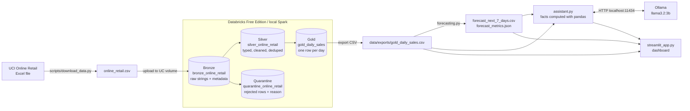

# AI Retail Analytics

[](https://github.com/vishalreddy9514/ai-retail-analytics/actions/workflows/tests.yml)

A small, end-to-end data engineering project on a year of real UK online retail transactions
(541,909 rows, [UCI Online Retail](https://archive.ics.uci.edu/dataset/352/online+retail)):

1. **Medallion pipeline:** Bronze → Silver → Gold Delta tables in PySpark on **Databricks Free Edition**,
   with a quarantine table and data quality checks.
2. **Forecasting:** a seven-day revenue forecast with **scikit-learn**, evaluated on a chronological
   hold-out with MAE and RMSE against a baseline.
3. **Generative AI:** a **local LLM assistant (Ollama)** that answers questions using figures
   computed from the Gold table and the forecast, and flags any number it cannot trace back to the data.
4. **Dashboard:** a **Streamlit** app with historical sales, the forecast, model accuracy and AI explanations.

Everything is free to run: Databricks Free Edition, open-source Python libraries, and a model running on your own laptop.

## Key results (real data, 9 October 2026)

| | |
|---|---|
| Rows ingested (Bronze) | 541,909 |
| Clean sales lines (Silver) | 522,568 |
| Rejected to quarantine, with reasons | 19,341 (Silver + quarantine = Bronze, so no row is lost) |
| Gold | 374 daily rows, 2010-12-01 to 2011-12-09 |
| Data quality checks | 13 of 13 passed; Gold revenue reconciles with Silver to the penny (£10,247,905.13) |
| Best forecast model (test MAE) | Seasonal-naive baseline, £11,207.54, about 25% of average daily revenue in the test period |
| LLM assistant | Answers checked against the data; the first version's invented figures were caught and fixed |

## Architecture



The pipeline logic is a normal Python package (`src/retail_analytics/`). The Databricks
notebooks are thin wrappers around it, so the **same code** runs on Databricks, locally and in `pytest`.

## Tech stack

Python 3.11 · PySpark · Delta Lake · Databricks Free Edition (Unity Catalog, serverless) ·
pandas · scikit-learn · Ollama (`llama3.2:3b`) · Streamlit + Altair · pytest · GitHub Actions

## Quick start

You need **Git**, **Python 3.11** and a free **Databricks Free Edition** account. The commands are
for Windows PowerShell; Mac/Linux equivalents are in comments.

**1. Clone and install** (on your laptop)

```powershell
git clone https://github.com/vishalreddy9514/ai-retail-analytics.git
cd ai-retail-analytics
py -3.11 -m venv .venv                # Mac/Linux: python3.11 -m venv .venv
.venv\Scripts\activate                # Mac/Linux: source .venv/bin/activate
pip install -r requirements.txt
```

**2. Download the dataset** (about 1 minute). This creates `data/raw/online_retail.csv`.

```powershell
python scripts/download_data.py
```

**3. Run the pipeline on Databricks** (in the browser)

1. In Databricks: **Workspace → Create → Git folder** and paste this repository's URL.
2. Open `notebooks/00_setup`, choose **Connect → Serverless**, then **Run all**. This creates the
   `workspace.retail` schema and the `raw_files` volume.
3. **Catalog → workspace → retail → raw_files → Upload to this volume**: upload `data/raw/online_retail.csv`.
4. Run `01_bronze_ingest`, `02_silver_clean` and `03_gold_daily_sales` in that order (**Run all** on each).
5. Download `raw_files/exports/gold_daily_sales.csv` from the Catalog page and save it as
   `data/exports/gold_daily_sales.csv` in the project folder.

**4. Forecast** (on your laptop)

```powershell
$env:PYTHONPATH="src"                 # Mac/Linux: export PYTHONPATH=src  (repeat in every new terminal)
python -m retail_analytics.forecasting
```

**5. Install Ollama and ask a question.** Install from <https://ollama.com/download> and choose
"use Ollama locally" (no account needed).

```powershell
ollama pull llama3.2:3b               # ~2 GB, runs on a laptop with 8 GB RAM
python -m retail_analytics.assistant "Which month had the highest revenue?"
```

**6. Open the dashboard** at <http://localhost:8501>

```powershell
streamlit run streamlit_app.py
```

**7. Run the tests**

```powershell
pytest -q
```

No Databricks account? Step 3 can run locally instead: see [Run the pipeline locally](#run-the-pipeline-locally-optional).

## Folder structure

```
ai-retail-analytics/
├── README.md
├── requirements.txt                # laptop: download, forecast, assistant, dashboard, tests
├── requirements-spark.txt          # optional: run the Spark pipeline locally
├── pyproject.toml                  # pytest config
├── streamlit_app.py                # dashboard
├── .github/workflows/tests.yml     # runs all tests on every push
├── data/                           # git-ignored; created by the steps above
│   ├── raw/online_retail.csv
│   ├── exports/gold_daily_sales.csv
│   └── outputs/                    # forecast results
├── notebooks/                      # Databricks notebooks (source format .py)
│   ├── 00_setup.py
│   ├── 01_bronze_ingest.py
│   ├── 02_silver_clean.py
│   └── 03_gold_daily_sales.py
├── scripts/
│   └── download_data.py            # UCI zip -> Excel -> CSV
├── src/retail_analytics/
│   ├── config.py                   # table names and paths (Databricks vs local)
│   ├── storage.py                  # SparkSession + Delta read/write
│   ├── bronze.py
│   ├── silver.py
│   ├── gold.py
│   ├── quality.py                  # data quality checks
│   ├── pipeline.py                 # runs Bronze -> Silver -> Gold; local CLI
│   ├── forecasting.py              # 7-day revenue forecast (scikit-learn)
│   └── assistant.py                # local LLM Q&A grounded in the data (Ollama)
└── tests/
```

## Stage 1: Bronze / Silver / Gold pipeline

| Layer | Table | Grain | What happens |
|---|---|---|---|
| Bronze | `bronze_online_retail` | one row per CSV line | All 8 source columns kept as strings, plus `_source_file` and `_ingested_at`. Nothing is dropped. |
| Silver | `silver_online_retail` | one row per valid sales line | snake_case names, types cast with `try_cast` (bad values become NULL instead of crashing the job), `invoice_date` and `line_total` derived. |
| Silver | `quarantine_online_retail` | one row per rejected line | Same columns plus `rejection_reason`. |
| Gold | `gold_daily_sales` | one row per calendar day | `revenue`, `orders`, `units_sold`, `unique_customers`, `line_items`, `avg_order_value`, `day_of_week`, `is_trading_day`. |

**Silver rejection rules** (the first matching rule wins): missing invoice number or stock code;
unparseable date, quantity or price; cancelled invoice (`InvoiceNo` starts with `C`);
quantity ≤ 0; unit price ≤ 0; non-product stock codes (postage, fees, manual adjustments;
see `NON_PRODUCT_CODES` in `silver.py`); and exact duplicate lines (the first copy is kept).
Rows with no `CustomerID` are kept, because they are still real sales from guest checkouts.

**Gold** has a row for every day between the first and last sale. Days without trading
(the retailer does not trade on Saturdays, plus the Christmas break) appear with zero revenue and
`is_trading_day = false`, which the forecast needs.

**Data quality checks** (`quality.py`) run after Silver and Gold are written and stop the pipeline
if any fail: no nulls in key columns, positive quantities and prices, no cancellations,
one Gold row per date, no missing dates, and Gold revenue reconciling with Silver.

**Results** (Databricks Free Edition, serverless):

| Quarantine reason | Rows |
|---|---|
| cancelled_invoice | 9,288 |
| duplicate | 5,221 |
| non_product_code | 2,315 |
| non_positive_quantity | 1,336 |
| non_positive_unit_price | 1,181 |
| **Total** | **19,341** |

No row failed type parsing (there are no `invalid_*` reasons). The last day, 2011-12-09, is partial
(the data ends at 12:50), and December 2011 therefore has only 9 days.

### Run the pipeline locally (optional)

The same pipeline runs without Databricks. It needs **Java 17** (`java -version`).

```powershell
pip install -r requirements-spark.txt
$env:PYTHONPATH="src"
python -m retail_analytics.pipeline   # writes Delta tables to data/delta/ and data/exports/gold_daily_sales.csv
```

On the first run, Spark downloads the Delta Lake jars from Maven.

## Stage 2: seven-day revenue forecast

`src/retail_analytics/forecasting.py` reads the Gold export and writes to `data/outputs/`.

- **Target:** daily `revenue`. The partial last day is dropped.
- **Features:** day of week; revenue 7 and 14 days ago; and the 7-day and 28-day averages ending 7 days ago.
  Every feature is at least 7 days old, so one model predicts all 7 future days from known
  history and no future information leaks into training.
- **Chronological split:** the last 56 days (8 weeks) are the test set and everything earlier is training.
  The data is never shuffled.
- **Models:**
  - `seasonal_naive` baseline ("same as the same weekday last week"). A model is only useful if it beats this.
  - `linear_regression`: Ridge regression.
  - `random_forest`: 300 trees, with `random_state=42` so results are reproducible.
- **Metrics:** MAE (average error in £) and RMSE (penalises large misses more), on the test set.
- **Forecast:** the model with the lowest test MAE is refit on all history and predicts the next 7 days.

| Output | Contents |
|---|---|
| `forecast_metrics.json` | train/test dates, MAE and RMSE per model, best model, average test-period revenue |
| `forecast_test_predictions.csv` | actual vs predicted revenue for every test day, per model |
| `forecast_next_7_days.csv` | `forecast_date`, `day_of_week`, `forecast_revenue`, `model` |

**Results.** Train: 2011-01-04 to 2011-10-13 (283 days). Test: 2011-10-14 to 2011-12-08 (56 days).

| Model | MAE (£) | RMSE (£) |
|---|---|---|
| **seasonal_naive** (baseline) | **11,207.54** | **15,904.82** |
| random_forest | 11,562.84 | 16,640.33 |
| linear_regression | 13,192.54 | 17,882.29 |

The baseline wins, so it produces the forecast. The test window is the pre-Christmas peak, with
revenue above anything in the training period. A random forest cannot predict above the range it
was trained on, and the linear model is pulled towards the yearly average, while "same weekday last
week" follows the rising level automatically. With only one year of history, no model can learn
yearly seasonality. The forecast's typical daily error is about 25% of average daily revenue, so treat it as a rough guide.

## Stage 3: local LLM assistant (Ollama)

`src/retail_analytics/assistant.py` answers plain-English questions about the sales data. The model
runs locally through [Ollama](https://ollama.com): free, offline, and the data never leaves the machine.
It stays grounded without a vector database or an agent framework:

1. **pandas computes the facts:**
   - totals, and monthly revenue with the change from the previous month;
   - average revenue per weekday, the top days and the last 14 days;
   - the 7-day forecast, ranked, with its total and the change from the previous 7 days;
   - the model scores, with the typical error as a % of daily revenue.

   Dates named in the question (`2011-11-15`) add those days. Two or more months
   (`November 2011`, `oct`) add a ready-made comparison.
2. **The model writes the answer from those facts only.** The system prompt tells it to:
   - copy each figure together with its own date;
   - never calculate anything itself;
   - say when a figure is not available.

   Temperature is 0, so the same question gives the same answer.
3. **Every number in the answer is checked** against the facts, and any that don't appear are flagged.

```powershell
python -m retail_analytics.assistant "How did November 2011 compare to October 2011?"
python -m retail_analytics.assistant --explain-forecast
python -m retail_analytics.assistant                                     # interactive mode
python -m retail_analytics.assistant "How was November 2011?" --show-context   # print the facts sent
```

Use another model with `--model llama3.1:8b` or by setting `OLLAMA_MODEL`. Set `OLLAMA_HOST`
if Ollama is not at `http://localhost:11434`.

**What the real runs showed.** The first version gave the model raw monthly totals. Asked
*"How did November 2011 compare to October 2011?"*, `llama3.2:3b` invented monthly unit and
customer figures and subtracted wrongly. The number check flagged four figures. It also attached a
forecast value to the wrong date. After all calculations moved into pandas, the same question gave
*"November 2011 revenue (£1,452,115.98) was £348,785.06 (+31.6%) higher than October 2011 revenue
(£1,103,330.92)"*, with no flagged numbers. The forecast explanation now gives the correct highest
day (2011-12-12, £80,011.23), total and error.

## Stage 4: Streamlit dashboard

`streamlit run streamlit_app.py` opens <http://localhost:8501>. It needs the Gold export and the
forecast outputs. Ollama is only needed for the two AI sections.

- **KPIs:** total revenue, orders, average revenue per trading day, average order value.
- **Daily revenue and 7-day forecast:** actual (blue) and forecast (orange, dashed). A slider sets the history shown,
  and you can hover any point for its value.
- **Monthly revenue** and the **next 7 days** table with the forecast total.
- **AI explanation of the forecast** (one click) and **Ask a question**. Each answer shows any flagged
  numbers and the exact facts sent to the model.
- **How accurate is the forecast?:** MAE/RMSE per model, the typical error, and actual vs predicted over the test period.

The blue (`#2a78d6`) and orange (`#eb6834`) pair stays distinguishable for colour-blind readers, and
every chart with two series has a legend.

## Tests

`pytest -q` runs:

- **Pipeline:** a local SparkSession runs small hand-written rows covering each cleaning rule,
  the Gold aggregation and zero-filling, and the quality checks. One test runs the whole pipeline end to
  end, writing real Delta tables to a temporary folder.
- **Forecast:** checks that the features only look back in time, the split is chronological,
  every model is scored, and the 7-day output is valid.
- **Assistant:** checks the computed facts, the date and month lookup and the number check, with Ollama
  replaced by a fake HTTP response.
- **Dashboard:** runs the app headlessly with Streamlit's `AppTest`: it renders, the explain button works,
  and a missing file shows instructions.

Without PySpark installed (`requirements.txt` only), the pipeline tests are skipped. The GitHub
Actions workflow installs `requirements-spark.txt` and runs everything on every push.

## Design decisions

| Decision | Why |
|---|---|
| Bronze keeps every column as a string | Loading never fails or loses data; typing and validation happen in Silver, where bad values can be quarantined. |
| Quarantine table instead of dropping rows | Every rejected row keeps its reason, so Silver + quarantine = Bronze can be proven. |
| `try_cast` / `try_to_timestamp` | One bad value becomes NULL and is quarantined, instead of failing the whole job (Databricks serverless runs in ANSI mode). |
| Full-refresh overwrite | The dataset is a fixed historical file, so a full rebuild is simplest and idempotent. Incremental `MERGE` would suit a live feed. |
| Gold zero-fills non-trading days | The forecast needs an unbroken daily series; Saturdays and holidays are real zeros, not missing data. |
| Same Python package on Databricks, locally and in tests | The logic is unit-tested once; notebooks only call it. |
| Baseline model in the comparison | It shows whether ML adds value. Here it didn't, and the project reports that rather than hiding it. |
| pandas computes, the LLM only phrases | Small models are unreliable at arithmetic; precomputed facts plus a number check keep answers traceable. |
| Local model, no vector DB or agent framework | The facts fit in one prompt (about 1,500 tokens); it is free, private and simple. |

## Limitations and next steps

- **One year of data:** yearly seasonality can't be learnt. More history, or holiday and trend
  features, would be the first improvement to the forecast.
- **Daily totals only:** the Gold table can't answer product, customer or country questions. A
  second Gold table (e.g. daily sales by country or product) would extend both the dashboard and the assistant.
- **Batch, manual runs:** next steps would be a scheduled Databricks Job, incremental loads with
  Delta `MERGE`, and MLflow to track forecast experiments.
- **A 3B model** can still misread facts. The number check catches invented figures, but not a real
  figure attached to the wrong date, so answers should be checked against the dashboard.

## Troubleshooting

| Problem | Fix |
|---|---|
| `running scripts is disabled` when activating the venv (Windows) | `Set-ExecutionPolicy -Scope CurrentUser RemoteSigned`, then activate again. |
| `ModuleNotFoundError: retail_analytics` | Run `$env:PYTHONPATH="src"` (Mac/Linux: `export PYTHONPATH=src`) in this terminal. On Databricks, open notebooks from the Git folder. |
| `No module named sklearn` / `streamlit` is not recognized | Activate the venv and run `pip install -r requirements.txt`. |
| Download script fails or hangs | Download the zip from the UCI page, unzip it, and run `python scripts/download_data.py --xlsx "path\to\Online Retail.xlsx"`. |
| CSV dates look like `12/1/2010` | The file was re-saved by Excel/WPS. Download or regenerate it, and don't save it from a spreadsheet app. |
| `PATH_NOT_FOUND ... raw_files/online_retail.csv` (Databricks) | The CSV isn't uploaded or has another name (e.g. `online_retail (1).csv`). Check the last cell of `00_setup`. |
| `DataQualityError: ... failed: <check>` | The `[FAIL]` line names the check and count. Inspect the Silver and quarantine tables. |
| Notebook doesn't pick up a change in `src/` | Run `%restart_python`, then re-run the notebook. |
| `gold_daily_sales.csv not found` | Download it from **Catalog → workspace → retail → raw_files → exports** into `data/exports/`. |
| `Move-Item: being used by another process` | Close the file in Excel/WPS first. |
| `Cannot reach Ollama at http://localhost:11434` | Start the Ollama app (llama icon by the clock) or run `ollama serve`. |
| `Model 'llama3.2:3b' is not installed` | `ollama pull llama3.2:3b` |
| Assistant is slow | The first answer loads the model (10–60 s). On low-RAM laptops try `ollama pull llama3.2:1b` and `--model llama3.2:1b`. |
| Port 8501 already in use | `streamlit run streamlit_app.py --server.port 8502` |
| `Java gateway process exited` (local Spark only) | Install Java 17 and set `JAVA_HOME`. |
| `pip install pyspark` fails building a wheel | `pip install -U pip setuptools wheel`, then retry. |

## Data source and licence

Chen, D. (2015). *Online Retail* [Dataset]. UCI Machine Learning Repository.
<https://archive.ics.uci.edu/dataset/352/online+retail>. Licensed under CC BY 4.0 (see the dataset page). The dataset is not stored in this
repository; `scripts/download_data.py` fetches it.
